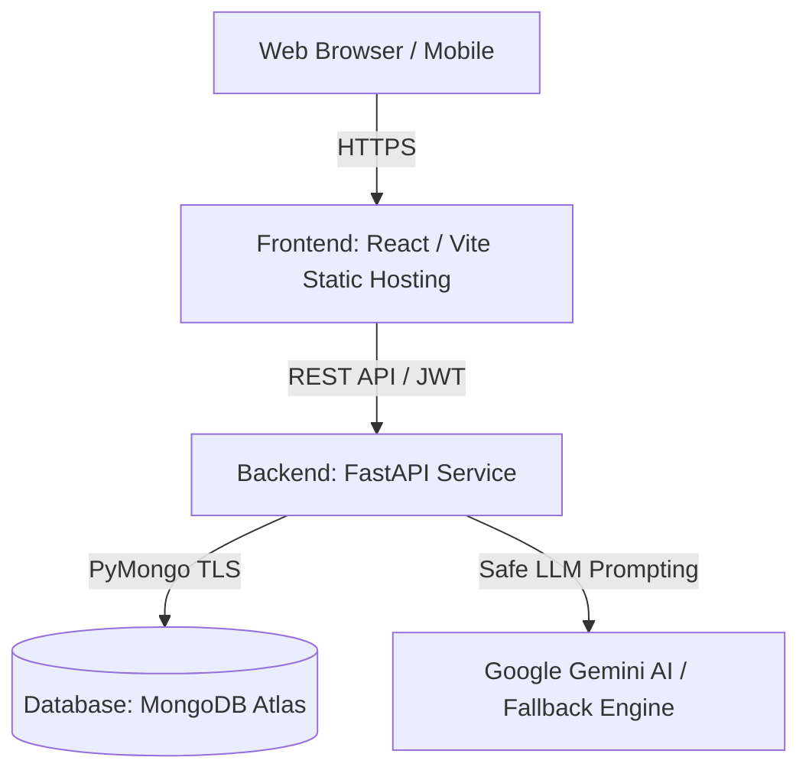

# EduManage — Intelligent Student Management System

EduManage is an enterprise-ready, production-grade Student Management System designed for modern higher-education institutions. Built with high security, authoritative Role-Based Access Control (RBAC), live MongoDB Atlas integration, and a dual-engine AI assistant (Google Gemini with deterministic fallback).

---

## 🚀 Key Features & Capabilities

- **🔐 Authoritative Authentication & Security**:
  - JWT Bearer authentication with configurable expiration.
  - State-of-the-art **Argon2** password hashing (never stored or returned in plaintext).
  - Authoritative backend Role-Based Access Control (RBAC) across **Admin**, **Teacher**, and **Student** roles.
  - Strict IDOR prevention on student profiles, attendance, marks, analytics, and reports.

- **👥 Comprehensive Student Lifecycle Management**:
  - Full CRUD operations with MongoDB Atlas unique constraints (Student ID, Roll Number, Email).
  - Soft-deactivation protection with active/inactive filtering.
  - Multi-parameter search across names, departments, sections, and IDs.

- **📅 Attendance Management**:
  - Real-time session attendance recording (Present, Absent, Late, Excused).
  - Automatic compound indexing on `(student_id, date)` preventing duplicate logs.
  - Student attendance history and aggregate percentage calculations.

- **📊 Marks & Grade Management**:
  - Assessment score recording with automatic server-side grade calculation (A+, A, B, C, D, E, F).
  - Multi-parameter filtering by semester (1-8), exam type, and academic year.
  - Student academic performance summaries and pass/fail metrics.

- **🛡️ AI Insights & Dropout Risk Analysis**:
  - Rule-based multi-factor risk radar analyzing attendance deficit, course failure rate, and grade trajectories.
  - Diagnostic factor explanation and personalized faculty intervention recommendations.

- **🤖 EduAI Academic Assistant**:
  - Provider-agnostic AI chat layer supporting **Google Gemini** with automatic fallback to **Deterministic AI engine**.
  - Strict context isolation: student queries can never access unauthorized institutional data or other students' private records.
  - Sensitive keyword filtering blocking prompt injection, credentials, and token leakage.

- **📈 Institutional Analytics & Live Dashboards**:
  - **Admin Dashboard**: Real-time KPI statistics, department enrollment matrices, attendance defaulters list, and institutional grade spread.
  - **Faculty Dashboard**: Active class rosters, today's timetable, recent postings, and students requiring attention.
  - **Student Portal**: Personal scorecards, attendance standing, personalized study recommendations, and course schedule.

- **📄 Reports & Data Exporting**:
  - Dynamic report roster with multi-criteria filtering.
  - Streaming RFC 4180 compliant CSV exports for students, attendance, and marks.
  - Standard ISO 32000-1 pure Python PDF transcript generation with strict RBAC.

---

## 🛠️ Technology Stack

| Layer | Technology |
|---|---|
| **Frontend Framework** | React 19 + Vite |
| **Styling** | Tailwind CSS + Lucide React Icons |
| **Routing** | React Router v7 |
| **Backend API** | FastAPI (Python 3.10+) + Pydantic v2 |
| **Database** | MongoDB / MongoDB Atlas (via PyMongo) |
| **Authentication & Hashing** | JWT (PyJWT) + Argon2 (pwdlib) |
| **AI Providers** | Google GenAI SDK (`gemini-2.5-flash-lite`) + Deterministic Engine |
| **Testing** | pytest + TestClient + mongomock |

---

## 📂 Project Structure

```
student-management-system/
├── backend/                        # FastAPI Backend Application
│   ├── app/
│   │   ├── api/                    # API Routers & Dependencies
│   │   │   ├── deps.py             # Auth & RBAC Dependencies
│   │   │   └── v1/
│   │   │       ├── api.py          # Central API Router
│   │   │       └── endpoints/      # Resource Endpoints (auth, users, students, attendance, marks, ai, analytics, reports)
│   │   ├── core/                   # Security & Settings
│   │   │   ├── config.py           # Environment Variables Loader
│   │   │   └── security.py         # Argon2 & JWT Security Utilities
│   │   ├── db/                     # MongoDB Manager & Index Initialization
│   │   ├── models/                 # Pydantic Schemas & DTOs
│   │   ├── services/               # Business Logic & AI Engines
│   │   └── main.py                 # Application Lifespan & CORS Configuration
│   ├── tests/                      # Full Backend Test Suite (168+ Tests)
│   ├── requirements.txt            # Python Dependencies
│   └── .env.example                # Backend Environment Variables Template
├── src/                            # React Frontend Source
│   ├── assets/                     # Logos and Brand Assets
│   ├── components/                 # Reusable UI Components
│   │   ├── auth/                   # Route Guards (ProtectedRoute, RoleRoute)
│   │   ├── common/                 # Buttons, Cards, Inputs, Modals, Tables, Tabs
│   │   └── layout/                 # Header, Sidebar, MainLayout
│   ├── context/                    # AuthContext & Session Management
│   ├── data/                       # Fallback Reference Mock Data
│   ├── pages/                      # Application Views
│   │   ├── admin/                  # Admin Dashboard & Reports Analytics
│   │   ├── ai/                     # Institutional AI Insights Radar
│   │   ├── auth/                   # SignIn Portal
│   │   ├── student-portal/         # Student Dashboard & EduAI Assistant
│   │   ├── students/               # Student Directory, Form, Profile
│   │   └── teacher/                # Faculty Dashboard, Attendance, Marks, Profile
│   ├── routes/                     # AppRoutes Definition
│   └── services/                   # API Client Services
├── .env.example                    # Frontend Environment Template
├── package.json                    # Node.js Package Configuration
└── vite.config.js                  # Vite Build Configuration
```

---

## 🔒 Role-Based Access Control (RBAC) Matrix

| Endpoint Group | Admin | Teacher | Student |
|---|:---:|:---:|:---:|
| **Student Management (Create, Edit, Deactivate)** | ✅ | ❌ | ❌ |
| **Student Directory & Detail View** | ✅ | ✅ | ❌ (Own `/me` only) |
| **Attendance Recording & Modification** | ✅ | ✅ | ❌ |
| **Attendance Permanent Deletion** | ✅ | ❌ | ❌ |
| **Marks Entry & Modification** | ✅ | ✅ | ❌ |
| **Marks Deletion** | ✅ | ❌ | ❌ |
| **Institutional Overview & Analytics** | ✅ | ❌ | ❌ |
| **Faculty Class Analytics** | ✅ | ✅ | ❌ |
| **Personal Student Analytics** | ✅ | ❌ | ✅ (Own only) |
| **Institutional AI Risk Overview** | ✅ | ✅ | ❌ |
| **EduAI Academic Assistant** | ✅ (Institutional) | ✅ (Class) | ✅ (Personal only) |
| **Institutional Reports & CSV Exports** | ✅ | ✅ | ❌ |
| **Official Student PDF Export** | ✅ (All) | ✅ (All) | ✅ (Own only) |

---

## ⚙️ Environment Configuration

### Backend (`backend/.env`)

```ini
# MongoDB Connection
MONGODB_URL=mongodb+srv://<username>:<password>@<cluster>.mongodb.net/?retryWrites=true&w=majority
MONGODB_DATABASE=edumanage
MONGODB_SERVER_TIMEOUT_MS=2000

# JWT Authentication
JWT_SECRET_KEY=your-secure-jwt-secret-key-minimum-32-characters
JWT_ALGORITHM=HS256
JWT_ACCESS_TOKEN_EXPIRE_MINUTES=60

# CORS Configuration (comma-separated origins)
CORS_ORIGINS=http://localhost:5173,http://127.0.0.1:5173,http://localhost:3000

# AI Provider Configuration ('gemini' or 'fallback')
AI_PROVIDER=fallback
GEMINI_API_KEY=
GEMINI_MODEL=gemini-2.5-flash-lite
```

### Frontend (`.env`)

```ini
# FastAPI Backend URL
VITE_API_BASE_URL=http://127.0.0.1:8000
```

---

## 🚀 Getting Started Locally

### 1. Prerequisites
- Node.js 18+ and npm
- Python 3.10+
- MongoDB Local or MongoDB Atlas Cluster

### 2. Backend Setup
```bash
cd backend
python -m venv venv
# On Windows:
venv\Scripts\activate
# On macOS/Linux:
source venv/bin/activate

pip install -r requirements.txt
cp .env.example .env
# Edit .env with your MongoDB Atlas connection string and JWT secret

python run.py
```
*The FastAPI backend will start at `http://127.0.0.1:8000` with interactive Swagger docs at `http://127.0.0.1:8000/docs`.*

### 3. Frontend Setup
```bash
# In project root directory
npm install
cp .env.example .env

npm run dev
```
*The React frontend will start at `http://localhost:5173`.*

---

## 🧪 Testing & Verification

### Running the Full Backend Test Suite
```bash
cd backend
python -m pytest -q
```
**Verified Baseline**: `168/168 tests passed` covering Auth, JWT, RBAC, Student CRUD, Attendance, Marks, AI Insights, EduAI Assistant, Analytics, Reports, and IDOR isolation.

### Running Frontend Production Build
```bash
npm run build
```
**Verified Result**: `1948 modules transformed. 0 build errors, 0 build warnings.`

---

## 🌐 Production Deployment Architecture



- **Frontend**: Deploy static bundle from `dist/` to Vercel, Netlify, Cloudflare Pages, or AWS S3 + CloudFront. Configure `VITE_API_BASE_URL` to point to backend.
- **Backend**: Deploy container or ASGI service (Render, Fly.io, AWS ECS, GCP Cloud Run) running `uvicorn app.main:app --host 0.0.0.0 --port 8000`. Configure `CORS_ORIGINS` to match your frontend domain.
- **Database**: MongoDB Atlas with IP Whitelisting and TLS connection string.
- **AI Engine**: Add `GEMINI_API_KEY` in backend environment variables to enable live Google Gemini reasoning.
